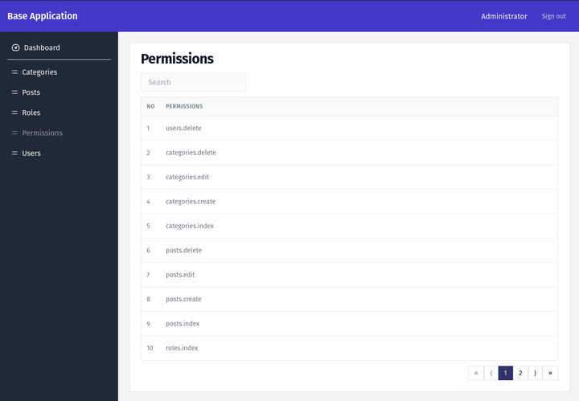
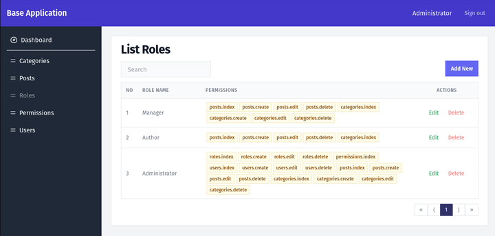
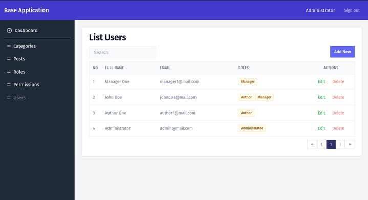
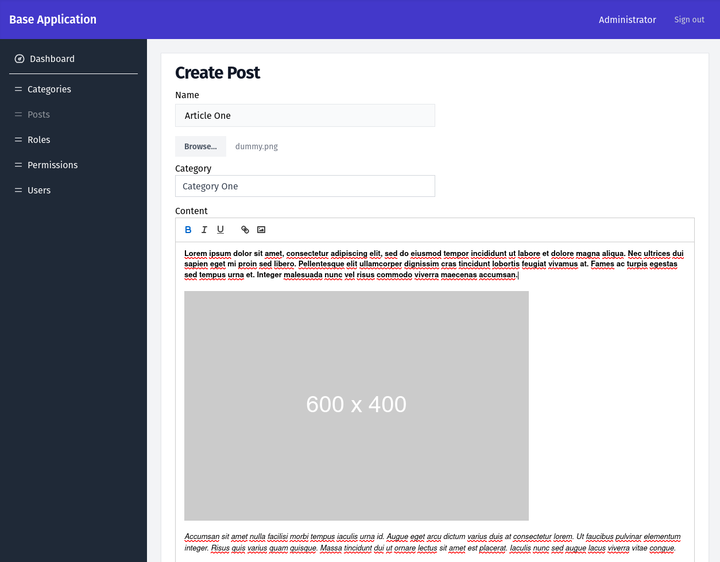

## Base Application

#### API

https://github.com/qrizan/laravel-swagger-roles

### setup

#### copy .env
> cp .env.example .env

#### api configuration
```
VITE_BASE_URL=http://localhost:8000
```

#### running

> cd react-tailwind-roles

> npm i

> npm run dev

#### screenshot







